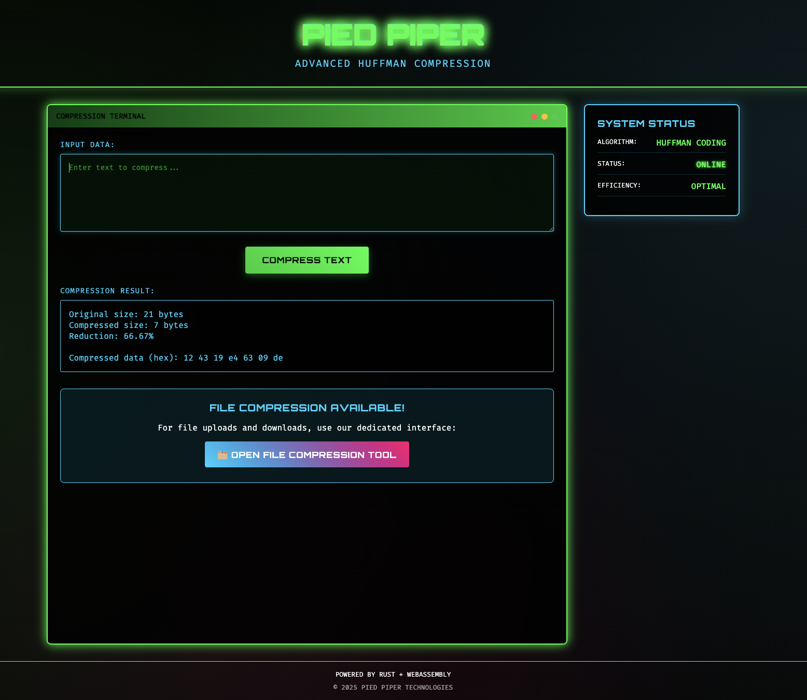

# Compression Algorithm

## Inspired by Pied Piper from HBO's Silicon Valley

_"Making the world a better place through optimal file compression algorithms"_

This project is a tribute to the fictional Pied Piper compression company from the hit HBO series Silicon Valley. Just like Richard Hendricks' revolutionary "middle-out" compression algorithm, this implementation explores multiple compression techniques to achieve optimal data reduction.

**The Pied Piper Vision**: Ultra-efficient compression that would make Dinesh proud and leave Gilfoyle impressed.

<!-- Uncomment when you add the hero image:

_Multi-algorithm compression suite with cyberpunk-themed web interface_
-->

---

A comprehensive Rust implementation of multiple compression algorithms (Huffman, LZ77, and RLE) with both CLI tools and a modern web interface built with Leptos, WebAssembly, and Flask.

## Features

### Compression Algorithms

- **Huffman Coding**: Optimal prefix-free encoding based on character frequencies
- **LZ77**: Sliding window compression that replaces repeated data with back-references
- **RLE (Run-Length Encoding)**: Efficient compression for data with consecutive repeated values

### Interfaces

- **CLI Tool**: Command-line interface for batch processing and automation
- **Web Frontend**: Modern cyberpunk-themed UI built with Leptos and WebAssembly
- **File Upload API**: Flask backend for web-based file processing
- **Real-time Compression**: Live compression ratio feedback

## Prerequisites

- **Rust** (latest stable version)
- **Python 3.x** with pip
- **cargo-leptos** for the web frontend
- **Node.js** (for end-to-end testing, optional)

## Installation

1. **Clone the repository:**

   ```bash
   git clone https://github.com/hunter-broughton/compression_algorithm.git
   cd compression_algorithm
   ```

2. **Install Rust dependencies:**

   ```bash
   cargo build
   ```

3. **Install cargo-leptos for the web frontend:**

   ```bash
   cargo install cargo-leptos
   ```

4. **Install Python dependencies for the file server:**
   ```bash
   cd file_server
   pip install flask flask-cors
   cd ..
   ```

## Usage

### CLI Tool

The command-line tool supports all three compression algorithms:

```bash
# Huffman compression
cargo run -- --input file.txt --output file.huffman --algorithm huffman --mode compress

# LZ77 compression
cargo run -- --input file.txt --output file.lz77 --algorithm lz77 --mode compress

# RLE compression
cargo run -- --input file.txt --output file.rle --algorithm rle --mode compress

# Decompression (works with any algorithm)
cargo run -- --input file.compressed --output file.original --algorithm huffman --mode decompress
```

**Available options:**

- `--input, -i`: Input file path (required)
- `--output, -o`: Output file path (optional, defaults to stdout info)
- `--algorithm, -a`: Compression algorithm (`huffman`, `lz77`, `rle`)
- `--mode, -m`: Operation mode (`compress`, `decompress`)

### Web Interface

The project includes two web interfaces:

#### 1. Start the Flask File Server (Backend)

```bash
cd file_server
python app.py
```

The server will start on `http://localhost:5001`

#### 2. Start the Leptos Frontend

```bash
cd pied-piper-compression
cargo leptos watch
```

The frontend will be available at `http://localhost:3000`

#### 3. Access the Applications

- **Main App**: http://localhost:3000 - Cyberpunk-themed interface with text compression
- **File Upload**: http://localhost:5001 - Drag-and-drop file upload with real-time compression

## 🔧 Development

### Project Structure

```
compression_algorithm/
├── src/                          # CLI tool source code
│   ├── main.rs                   # CLI entry point
│   └── compression/              # Compression algorithms
│       ├── huffman.rs           # Huffman coding implementation
│       ├── lz77.rs              # LZ77 compression
│       ├── rle.rs               # Run-length encoding
│       └── mod.rs               # Module definitions
├── pied-piper-compression/       # Leptos web frontend
│   ├── src/
│   │   ├── app.rs               # Main Leptos application
│   │   ├── lib.rs               # Library entry point
│   │   └── main.rs              # Server entry point
│   ├── style/main.scss          # Cyberpunk theme styling
│   └── Cargo.toml              # Frontend dependencies
├── file_server/                  # Flask backend
│   ├── app.py                   # Flask server with upload API
│   └── test_upload.html         # File upload interface
└── Cargo.toml                   # Main project dependencies
```

### Building for Production

#### CLI Tool

```bash
cargo build --release
```

#### Web Frontend

```bash
cd pied-piper-compression
cargo leptos build --release
```

### Running Tests

#### Rust Tests

```bash
cargo test
```

#### End-to-End Tests (requires Node.js)

```bash
cd pied-piper-compression/end2end
npm install
npx playwright test
```

## Performance Comparison

Different algorithms excel with different data types:

| Algorithm   | Best For                        | Example Performance                    |
| ----------- | ------------------------------- | -------------------------------------- |
| **RLE**     | Highly repetitive data          | 96.8% compression on repeated patterns |
| **Huffman** | Text with varied frequencies    | 50-70% compression on natural text     |
| **LZ77**    | General-purpose, mixed patterns | 50-60% compression on typical text     |

### Benchmark Examples

```bash
# Test with highly repetitive data (optimal for RLE)
echo "AAAABBBBCCCCDDDD..." > test.txt
cargo run -- -i test.txt -a rle    # ~97% compression

# Test with natural text (good for Huffman)
cargo run -- -i document.txt -a huffman  # ~50-70% compression

# Test with mixed patterns (versatile LZ77)
cargo run -- -i source_code.rs -a lz77   # ~40-60% compression
```

## 🎨 Web Interface Features

### Main Leptos App (localhost:3000)


_Cyberpunk-themed compression interface with real-time statistics_

- Cyberpunk-themed UI with neon aesthetics
- Real-time text compression with live statistics
- Multiple algorithm selection
- Responsive design with Matrix-style animations

### File Upload Interface (localhost:5001)

<!-- Uncomment when you add the file upload screenshot:

_Drag-and-drop file compression with live feedback_
-->

- Drag-and-drop file upload
- Real-time compression feedback
- Download compressed files
- Support for any file type
- Integration with Rust CLI tools

### CLI Tool in Action

<!-- Uncomment when you add the CLI screenshot:

_Command-line compression showing performance metrics_
-->

## Troubleshooting

### Common Issues

1. **"cargo-leptos not found"**

   ```bash
   cargo install cargo-leptos
   ```

2. **Flask server won't start**

   ```bash
   pip install flask flask-cors
   ```

3. **CORS errors in browser**

   - Ensure Flask server is running on port 5001
   - Check that CORS is enabled in app.py

4. **WebAssembly build fails**
   ```bash
   rustup target add wasm32-unknown-unknown
   ```

### Performance Tips

- Use RLE for data with long runs of identical values
- Use Huffman for text files with varied character frequencies
- Use LZ77 for general-purpose compression of mixed content
- For small files (<100 bytes), compression may increase size due to overhead

## Contributing

1. Fork the repository
2. Create a feature branch (`git checkout -b feature/amazing-feature`)
3. Commit your changes (`git commit -m 'Add amazing feature'`)
4. Push to the branch (`git push origin feature/amazing-feature`)
5. Open a Pull Request

## License

This project is licensed under the MIT License - see the LICENSE file for details.

## Acknowledgments

- Inspired by classic compression algorithms and modern web technologies
- Built with the Rust and Leptos ecosystems
- Cyberpunk theme inspired by retro-futuristic aesthetics
